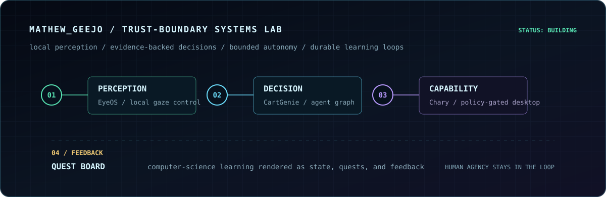
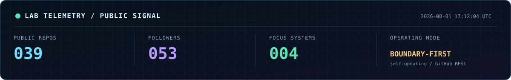
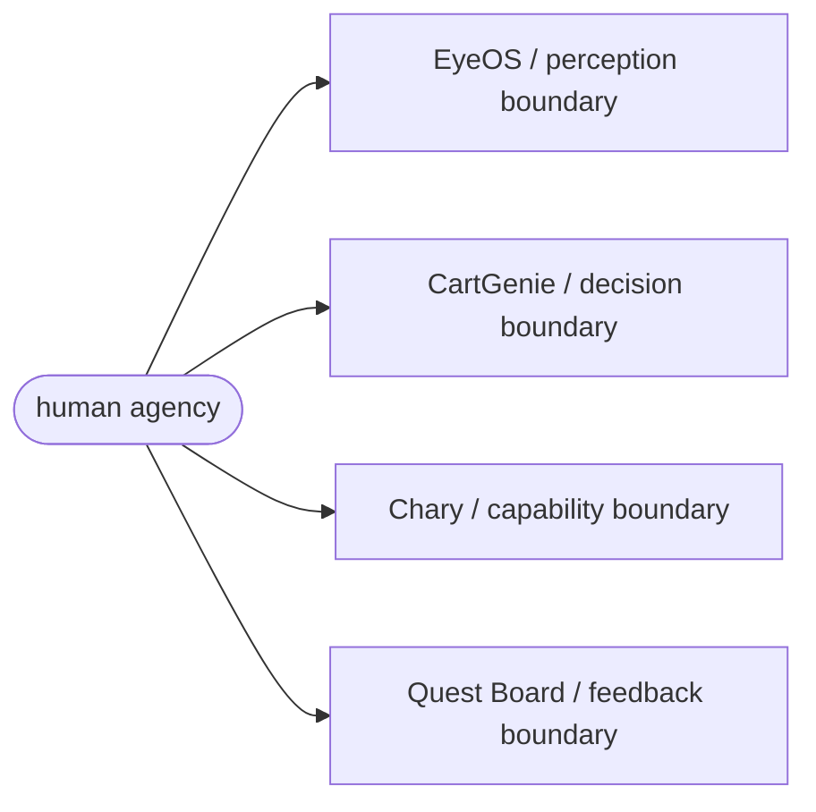

<!--
  MATHEWGEEJO / TRUST-BOUNDARY SYSTEMS LAB
  This profile is deliberately built from repository-owned assets and live GitHub telemetry.
-->

<p align="center">
  
</p>

<p align="center">
  
</p>

```text
$ cat mission.txt
I build software for moments where a wrong answer has consequences:
local accessibility input, tool-using agents, desktop automation, and learning systems.

The interesting work is not making a system look clever.
It is deciding what that system is allowed to know, do, and fail at.
```

## `design_constraints.md`

```text
[01] Keep sensitive input close to the person who created it.
[02] Make an agent's authority narrower than its apparent intelligence.
[03] Treat uncertainty as an output, not an implementation detail.
[04] Prefer a safe pause over an impressive but unsafe guess.
[05] Design progress loops that help people learn, not just keep clicking.
```



## `./run-oncall-simulation --trust-boundaries`

You are on call for three systems. Choose your response before opening the result.

<details>
  <summary><code>INC-01 / EYEOS</code> Tracking confidence drops while a dwell-click is active.</summary>
  <br />

  <details>
    <summary><code>A</code> Preserve the click so the interaction feels continuous.</summary>
    <br />
    Incorrect. An uncertain input system must not keep acting on behalf of a person.
  </details>

  <details>
    <summary><code>B</code> Release held input and pause control.</summary>
    <br />
    Correct. EyeOS releases held input when tracking is lost and stays paused instead of guessing.
    <br /><br />
    <code>camera -> local landmarks -> CPU gaze inference -> calibration -> bounded desktop input</code>
  </details>
</details>

<details>
  <summary><code>INC-02 / CARTGENIE</code> Product evidence conflicts just before a recommendation is finalised.</summary>
  <br />

  <details>
    <summary><code>A</code> Collapse the disagreement into the most confident-sounding answer.</summary>
    <br />
    Incorrect. A fluent answer is not a substitute for a defensible decision.
  </details>

  <details>
    <summary><code>B</code> Hold at the human-in-the-loop checkpoint and keep the evidence trace.</summary>
    <br />
    Correct. CartGenie is built around retrieval, specialist agents, checkpointing, and resume—not an uninspectable final guess.
    <br /><br />
    <code>request -> LangGraph -> agent fan-out -> hybrid RAG -> HITL checkpoint -> streamed response</code>
  </details>
</details>

<details>
  <summary><code>INC-03 / CHARY</code> A desktop agent requests a higher-risk local action.</summary>
  <br />

  <details>
    <summary><code>A</code> Let the model decide; it has already explained why it needs access.</summary>
    <br />
    Incorrect. Explanation is not authorisation.
  </details>

  <details>
    <summary><code>B</code> Check the capability allowlist, request approval, then record the local audit trail.</summary>
    <br />
    Correct. Chary combines a safety gate, bounded native bridge, explicit approval for riskier actions, and local logging.
    <br /><br />
    <code>local model -> policy gate -> tool registry -> approval -> Tauri bridge -> audit log</code>
  </details>
</details>

<details>
  <summary><code>INC-04 / QUEST BOARD</code> A learner tries to submit before every task in a quest is complete.</summary>
  <br />

  <details>
    <summary><code>A</code> Award partial XP to preserve the momentum.</summary>
    <br />
    Incorrect. A progression system loses meaning when its state can drift from the work actually completed.
  </details>

  <details>
    <summary><code>B</code> Reject the submission until progress reaches 100%, then update XP and level together.</summary>
    <br />
    Correct. Quest Board blocks early submission and treats XP and level changes as one Prisma transaction.
    <br /><br />
    <code>quest tasks -> completion check -> transaction -> XP ledger -> level / badge state</code>
  </details>
</details>

```text
RESULT: 04/04 — you design for human agency.
```

## `casefiles/`

<details open>
  <summary><code>01 / EYEOS</code> — access without surrender</summary>
  <br />

  <b>System invariant:</b> raw camera frames, calibration samples, and text predictions stay on-device; live input is unavailable until independently validated calibration passes.
  <br /><br />

  ```text
  MediaPipe face landmarks
    -> rotated eye crops
    -> OpenVINO CPU head-pose + binocular gaze inference
    -> per-user quadratic calibration
    -> dwell state machine
    -> normal signed-in Windows desktop
  ```

  It is deliberately scoped away from UAC, the lock screen, and the secure desktop. A six-term, 25-point calibration is followed by a separate five-target validation pass; if a reviewed local model or calibration is missing, the control loop remains paused.
  <br /><br />
  <a href="https://github.com/mathewgeejo/eyeos"><b>Inspect EyeOS source -></b></a>
</details>

<details>
  <summary><code>02 / CARTGENIE</code> — decision support with a paper trail</summary>
  <br />

  <b>System invariant:</b> recommendations should be recoverable, observable, and interruptible—not simply plausible.
  <br /><br />

  ```text
  Next.js streaming client
    -> FastAPI gateway (JWT, rate limits, SSE / WebSocket)
    -> LangGraph conditional loops + subgraph fan-out
    -> search | pricing | reviews | negotiation | decision agents
    -> dense + sparse retrieval + compression + cross-encoder reranking
    -> HITL checkpoint / resume
  ```

  The system is async-first and typed, with test layers spanning unit, integration, graph, RAG, end-to-end, and load tests. It also exposes observability hooks through LangSmith and OpenTelemetry.
  <br /><br />
  <a href="https://github.com/mathewgeejo/CartGenie"><b>Inspect CartGenie source -></b></a>
</details>

<details>
  <summary><code>03 / CHARY</code> — a desktop agent with a smaller blast radius</summary>
  <br />

  <b>System invariant:</b> personality and autonomy never silently widen a model's permissions.
  <br /><br />

  ```text
  Pixi.js character runtime + Svelte UI
    -> local LLM streaming (Ollama / OpenAI-compatible endpoint)
    -> safety gate + tool registry
    -> allowlisted Tauri command bridge
    -> explicit approval for medium / high-risk actions
    -> local audit log + short-term memory
  ```

  Chary is a Windows desktop assistant that keeps its native reach deliberately bounded: application launches are allowlisted, and file access is limited to Desktop, Documents, and Downloads.
  <br /><br />
  <a href="https://github.com/mathewgeejo/chary"><b>Inspect Chary source -></b></a>
</details>

<details>
  <summary><code>04 / QUEST BOARD</code> — learning as a stateful system</summary>
  <br />

  <b>System invariant:</b> game mechanics should reveal progress, not disguise the absence of it.
  <br /><br />

  ```text
  quest interface
    -> Next.js 14 application
    -> NextAuth identity + Prisma data layer
    -> MongoDB learner state
    -> Zustand client state + Zod validation
    -> Framer Motion / Three.js feedback loops
  ```

  Quest Board explores what happens when computer-science learning is treated as an evolving system of quests, identity, state, and feedback rather than a static course page. Its schema models six role paths and four progression layers; completed work updates XP and level state transactionally.
  <br /><br />
  <a href="https://github.com/mathewgeejo/quest-board"><b>Inspect Quest Board source -></b></a>
</details>

<hr />

<p align="center">
  <code>Interested in an architecture decision, a safety boundary, or a strange prototype? Start with a case file.</code>
</p>
